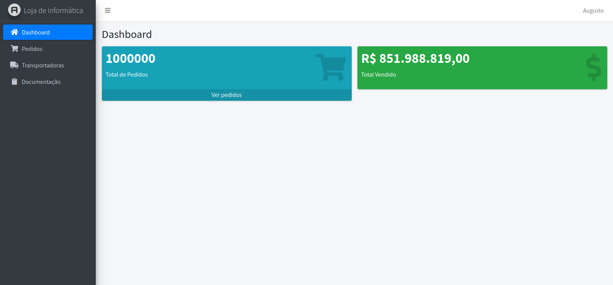
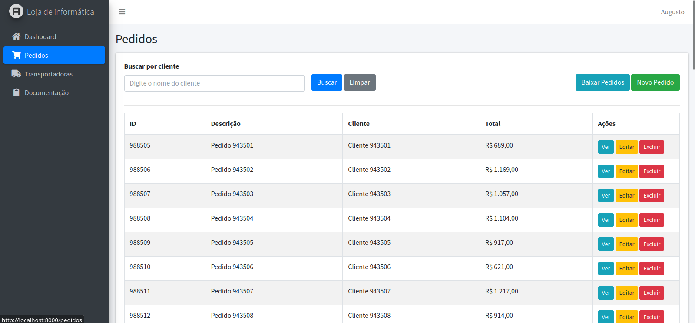
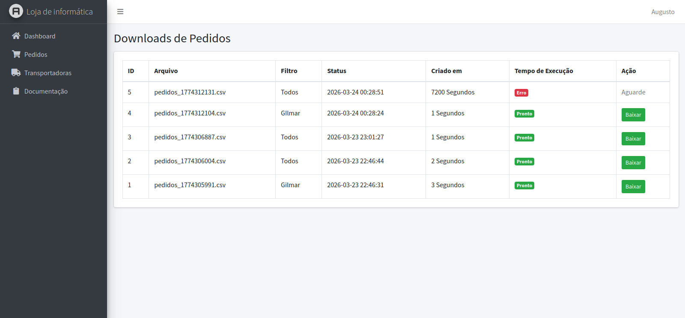
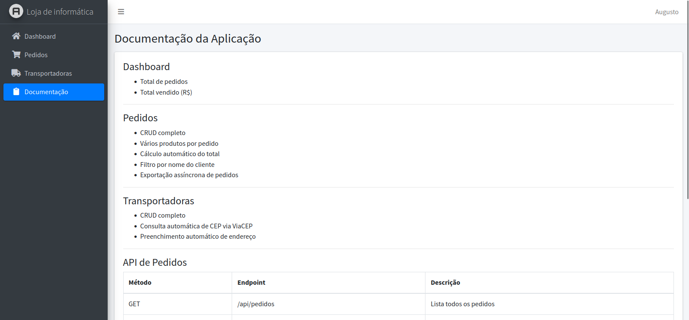

# Loja Modelo – Avaliação Técnica

Projeto desenvolvido como **avaliação técnica** para demonstrar habilidades em PHP e Laravel no desenvolvimento de aplicações web escaláveis. O objetivo é gerenciar pedidos de uma loja de informática, operando com grandes volumes de dados.

---

## 📝 Desafio Técnico

O projeto atende ao desafio de criar uma aplicação web com os seguintes requisitos:

- **Framework:** Laravel (PHP)  
- **Banco de dados:** relacional, capaz de suportar mais de 1 milhão de pedidos  
- **Interface:** baseada em AdminLTE  
- **Funcionalidade:** CRUD completo de pedidos e transportadoras, dashboard de indicadores e exportação de registros em CSV  
- **Desempenho:** inserção automatizada de pelo menos 1 milhão de pedidos, paginação eficiente e download completo em CSV  
- **API:** endpoints para listar pedidos, consultar por ID e criar pedidos  

### Requisitos principais:

1. **Menu:** Dashboard, Pedidos e Transportadoras  
2. **Pedidos:**  
   - Campos: Descrição, Nome do cliente, Produto, Preço, Quantidade e Total (calculado automaticamente)  
   - Paginação: 50 registros por página  
   - Busca por cliente  
   - Exportação CSV de todos os registros  
3. **Transportadoras:**  
   - Campos: Nome, CNPJ, Endereço completo  
   - Endereço preenchido automaticamente via API [ViaCEP](https://viacep.com.br)  
4. **Dashboard:** Indicadores principais (total de pedidos e total vendido)  
5. **API:** CRUD básico de pedidos  

**Considerações técnicas:**  
- Capacidade de lidar com grande volume de dados mantendo desempenho  
- Soluções escaláveis para exportação e listagem de dados  

**Bônus:**  
- MCP para consulta rápida de pedidos  
- Página com documentação das funcionalidades implementadas  

---

## 📦 Funcionalidades implementadas

- CRUD completo de **Pedidos** e **Transportadoras**  
- Dashboard com principais indicadores  
- Paginação eficiente e busca de registros  
- Download CSV escalável, sem limite de página  
- Preenchimento automático de endereço por CEP via API  
- API REST para pedidos (listar, consultar e criar)  
- Suporte a mais de 1 milhão de registros  

---

## ⚙️ Tecnologias

- PHP 8.x  
- Laravel 11  
- AdminLTE  
- MySQL ou SQLite para desenvolvimento/testes  
- Eloquent ORM  
- Tailwind CSS + Vite  
- GuzzleHTTP para consumo da API ViaCEP  

---

## 🖼 Demonstração do sistema

Dashboard:
  

Pedidos:
 

Downloads de Relatórios:
 

Transportadoras:
  

Documentacao API:
  
